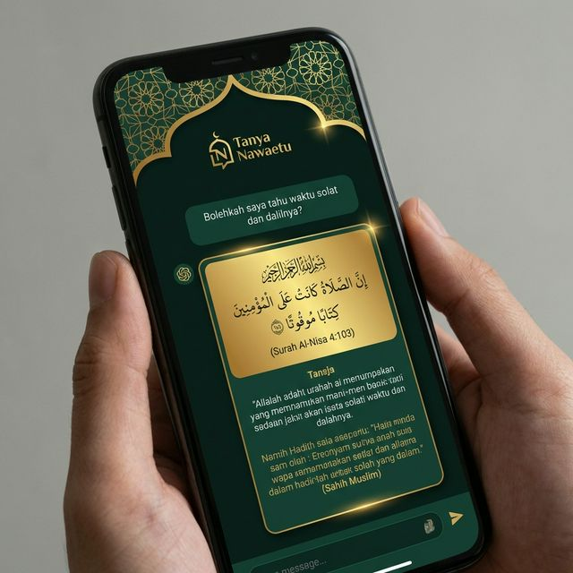

# Nawaetu 🌙✨

[](https://github.com/hadianr/nawaetu/releases)
[](https://nawaetu.com)
[](LICENSE)
[](#lisensi)
[](https://github.com/hadianr/nawaetu/issues)
[](https://github.com/hadianr/nawaetu)
[](https://github.com/hadianr/nawaetu/releases)

---

### 🎯 Luruskan Niat, Bangun Kontribusi Nyata
**Nawaetu** (diambil dari kata "Niat") adalah **aplikasi tracker habit Islami pertama di dunia yang berbasis Intention-First**. Jika aplikasi lain fokus pada mekanik ritual (hitung jadwal, jumlah tasbih), Nawaetu fokus pada **inti spiritual** ibadah: **Niat.**

[**🚀 Coba Live Demo**](https://nawaetu.com) | [**📖 Read in English 🇬🇧**](README.md)

---

## 📑 Daftar Isi
- [🎯 Apa yang Membuat Nawaetu Berbeda?](#-apa-yang-membuat-nawaetu-berbeda)
- [✨ Galeri Visual](#-galeri-visual)
- [🌟 Pilar Utama & Fitur](#-pilar-utama--fitur)
- [🛠️ Tech Stack](#️-tech-stack)
- [🚀 Memulai (Getting Started)](#-memulai-getting-started)
- [📄 Lisensi](#-lisensi)
- [🤝 Kontribusi](#-kontribusi)

> [!IMPORTANT]
> **Nawaetu menggunakan Dual Licensing.** Gratis untuk Open Source (AGPLv3), namun memerlukan **Lisensi Komersial** untuk penggunaan komersial/proprietary.

### 🚀 Highlight Terbaru (v1.9.x)
- **🌙 Dzikir 2.0 & Mode Zen**: Overhaul besar-besaran pada fitur Tasbih.
  - **Dzikir Berantai (Sequential)**: Alur otomatis untuk dzikir bakda sholat (Subhanallah → Alhamdulillah → Allahu Akbar).
  - **Mode Zen (Optimasi OLED)**: Imersi penuh layar bersih dengan **Feedback Ripple** dinamis dan rendering berbasis Portal untuk menutupi seluruh UI.
  - **Dzikir Kustom**: Tambahkan bacaan sendiri dengan target personal dan pantau statistik seumur hidup.
  - **Perpustakaan Dzikis**: Katalog dzikir shahih yang diperluas, lengkap dengan arti dan tadabbur.
- **📖 Al-Qur'an Disempurnakan**: Pengalaman membaca yang lebih profesional dengan fitur kelas enterprise.
  - **Mode Hafalan (Hafiz Mode)**: Fitur "Peek" per-ayat menggunakan efek blur, memungkinkan pengguna mengintip ayat saat menghafal sesuai metode tahfiz tradisional.
  - **Tooltip Interaktif**: Penambahan tooltip pada semua ikon aksi (Play, Bookmark, Share, Tafsir, Hafiz Mode) untuk UX yang lebih intuitif.
  - **Smart Audio Caching**: Penanganan `AbortError` dan interupsi pemutaran untuk pengalaman murottal yang lancar tanpa terputus.
  - **Cloud Last-Read Sync**: Posisi terakhir bacaan Al-Qur'an (Surat dan Ayat) otomatis tersinkronisasi di Cloud, memungkinkan Anda melanjutkan bacaan dari perangkat manapun dengan instan.
  - **Terjemahan Kata-per-Kata Dwibahasa**: Render terjemahan kata per kata yang langsung beradaptasi dengan bahasa perangkat (ID/EN) untuk memudahkan belajar bahasa Arab Al-Qur'an.
  - **Vercel Speed Insights**: Terintegrasi penuh dengan pelacakan performa Web Vitals langsung dari Vercel.
- **🔇 Update Sistem Feedback**: Fitur getar telah dihapus seluruhnya untuk menjaga reliabilitas lintas perangkat pada Web/PWA, berfokus pada feedback suara berkualitas tinggi dan mode mute.
- **🌙 Pelacak Puasa Ramadhan**: Logger puasa berbasis kalender dengan status fiqih (Puasa, Sakit, Musafir, dsb), preview konsekuensi (Qadha/Fidyah), dan reward Hasanah.
- **💎 Gamifikasi Hasanah**: Sistem pertumbuhan spiritual yang mengganti "XP" menjadi "Hasanah," lengkap dengan progres Rank (Mubtadi → Muhsinin) dan milestone.
- **📊 Dashboard Statistik Ibadah**: Halaman `/stats` komprehensif dengan Chart Tren Hasanah, pelacak Konsistensi Sholat, dan riwayat Rank.
- **🕌 Kartu Konsistensi Sholat**: Pelacak visual 7h/14h dengan dot status per-sholat, dioptimalkan untuk check-in mobile yang cepat.

---

## 🎯 Apa yang Membuat Nawaetu Berbeda?

**Hampir setiap aplikasi Islam memiliki jadwal sholat, Qur'an, dan Kiblat. Tapi hampir tidak ada yang fokus pada *alasan* (why) di balik ibadahmu.**

### Keunikan Nawaetu:
1.  🎯 **Pionir Intention-First**: Kami menjadikan "Niat" sebagai habit yang bisa dilacak, memindahkan fokus pertumbuhan spiritual dari jari (tasbih) ke hati.
2.  🤖 **Tanya Nawaetu**: Tanya jawab Islami yang merujuk pada Al-Qur'an, Sunnah, dan Hadits shahih—bukan sekadar opini AI.
3.  📔 **Loop Muhasabah**: Menghubungkan niat di pagi hari dengan refleksi di malam hari secara mulus.
4.  🎮 **Hasanah Spiritual**: Menggantikan gamifikasi generik dengan pencapaian Islami yang bermakna dan "Istiqamah Streak."
5.  🛡️ **Siap Enterprise**: Dibangun dengan arsitektur Next.js yang skalabel, dukungan whitelabel, dan skema lisensi ganda.

---

## ✨ Galeri Visual

| Jurnal Niat | Tanya Nawaetu | Al-Qur'an (Mushaf) |
| :---: | :---: | :---: |
|  |  |  |

---

## 🌟 Pilar Utama & Fitur

### 1. 🎯 Pembinaan Berbasis Niat
*   **Jurnal Niat**: Tetapkan "Niat" setiap pagi dan refleksi di malam hari (Muhasabah Jiwa).
*   **Tanya Nawaetu**: Asisten Islami 24/7 yang memberikan jawaban berdasarkan Al-Qur'an, Sunnah, dan Hadits yang dapat dipertanggungjawabkan.
*   **Gamifikasi Ibadah**: Kumpulkan Niat Points melalui misi harian yang bermakna.

### 2. 📖 Konten Spiritual Terpadu
*   **Al-Qur'an Digital**: Mode Mushaf & List dengan audio per ayat, pewarnaan Tajwid, dan standar Mushaf Kemenag RI.
*   **Hub Hadits & Doa**: Konten pilihan harian dengan terjemahan Bahasa Indonesia dan Inggris.
*   **Feed Spiritual**: Widget Daily Spirit, Quote of the Day, dan Hadits harian.

### 3. 🕌 Presisi Ritual
*   **Adzan Presisi Tinggi**: Jadwal sholat berbasis GPS dengan akurasi notifikasi < 60 detik.
*   **Kompas Kiblat**: Penunjuk arah presisi berbasis sensor perangkat.
*   **Kalibrasi Hijriah**: Penyesuaian tanggal yang fleksibel sesuai dengan pengamatan hilal lokal.

### 4. 📈 Alat Konsistensi (Istiqamah)
*   **Tasbih 2.0**: Penghitung canggih dengan mode Berantai (Sequential), bacaan Kustom, dan Mode Zen OLED.
*   **Check-in Sholat**: Pelacak ritual presisi tinggi dengan opsi jamaah/sendiri.
*   **Dashboard Ibadah**: Statistik seumur hidup, milestone, dan visualisasi tren Hasanah.

### 5. 🌙 Pusat Ramadhan (Musiman)
*   **Panduan Ramadhan**: Fiqh khusus, FAQ, dan panduan amalan selama bulan suci.
*   **Nutrisi Sunnah & Tips**: Rekomendasi makanan Sahur dan Iftar berdasarkan Sunnah.
*   **Countdown Ramadhan**: Pelacakan presisi untuk hilal dan hitung mundur harian.

---

## ⚡ Performance & Optimization

**PageSpeed Insights Score: 88-93/100** 🚀

Kami obsessed sama performa karena ibadah gak boleh distracted sama lag:

### 🎨 Core Web Vitals
- ⚡ **First Contentful Paint**: 2.1s
- 🖼️ **Largest Contentful Paint**: 3.2s
- 📊 **Cumulative Layout Shift**: 0.064 (Excellent!)
- ⏱️ **Total Blocking Time**: 80ms

### 🛠️ Technical Optimizations
- ✅ **Advanced Code Splitting**: Main chunk optimized, unused code tree-shaken
- ✅ **CSS Optimization**: Critical CSS inlined, non-critical deferred
- ✅ **Image Optimization**: AVIF/WebP dengan lazy loading
- ✅ **Script Deferral**: Analytics & monitoring dimuat setelah LCP
- ✅ **Webpack Tuning**: minChunks: 3, usedExports: true, sideEffects: false
- ✅ **Font Display Swap**: Fonts load tanpa blocking render
- ✅ **Reduced Bundle Size**: Removed transpilePackages untuk ES6 native

### 📱 Accessibility: 100/100
- ✅ **WCAG 2.1 AA Compliant**
- ✅ **Keyboard Navigation**: Full keyboard support
- ✅ **Screen Reader Friendly**: Semantic HTML & ARIA labels
- ✅ **Color Contrast**: All text meets contrast ratio requirements
- ✅ **Focus Management**: Clear focus indicators

### 🔒 Best Practices: 100/100
- ✅ **HTTPS Everywhere**
- ✅ **No Console Errors**
- ✅ **Modern Image Formats**
- ✅ **Secure Dependencies**
- ✅ **CSP Headers**

### 🔍 SEO: 100/100
- ✅ **Meta Tags Optimized**
- ✅ **Semantic HTML5**
- ✅ **Open Graph & Twitter Cards**
- ✅ **Sitemap & Robots.txt**
- ✅ **Structured Data (JSON-LD)**
- ✅ **Mobile-Friendly**

---

## 🛠️ Tech Stack

Dibangun dengan teknologi bleeding-edge untuk experience terbaik:

### Core Framework
*   **Next.js 16.1.6** (App Router + Turbopack) - React meta-framework
*   **TypeScript** - Type-safe development
*   **React 19** - Latest React with concurrent features

### AI & APIs
*   **Google Gemini 2.5 Flash-Lite** - Fast & accurate AI responses
*   **Groq Llama 3.3 70B** - High-performance inference
*   **Prayer Times API** - Accurate prayer schedules
*   **Kemenag Quran API** - Surah, terjemahan & tafsir Indonesia
*   **Quran.com API (Uthmani)** - Arabic text dengan harakat lengkap
*   **Firebase Admin SDK** - Server-side messaging & notifications [NEW v1.5.0]
*   **Vercel Cron** - Scheduled background tasks [NEW v1.5.0]

### Backend & Database (v1.2.0 Ready)
*   **Drizzle ORM** - TypeScript ORM for scaling
*   **Postgres Ready** - Architecture prepared for database migration
*   **NextAuth.js** - Authentication ready
*   **Centralized API Config** - DRY architecture for external services

### Styling & UI
*   **Tailwind CSS v4** - Utility-first CSS framework
*   **Shadcn UI** - Beautiful & accessible components
*   **Framer Motion** - Smooth animations
*   **Lucide React** - Modern icon library

### Performance & Monitoring
*   **Sentry** - Error tracking & performance monitoring
*   **Google Analytics 4** - User behavior analytics (deferred load)
*   **Web Vitals** - Real user monitoring
*   **PWA** - Installable on all platforms

### Developer Experience
*   **ESLint** - Code linting
*   **Prettier** - Code formatting
*   **Husky** - Git hooks (optional)

---

## 🚀 Deployment

### Live Demo
- 🌐 **Production**: [nawaetu.com](https://nawaetu.com)
- 📊 **Vercel Dashboard**: [Vercel Console](https://vercel.com)

### Auto-Deployment Pipeline

**Trigger Events:**
```
Push ke main branch
    ↓
Vercel: Auto-Build & Test
    ↓
Vercel: Auto-Deploy (production)
    ↓
Live pada nawaetu.com ✅
```

**Deployment Flow:**
1. Code pushed ke GitHub `main` branch
2. Vercel automatically triggers build & test
3. Jika build success ✅
4. Vercel automatically deploy to production (~2-5 min)
5. Deploy logs bisa dilihat di Vercel dashboard

### Deployment Status

| Environment | URL | Status |
|---|---|---|
| **Production** | https://nawaetu.com | 🟢 Active |
| **Preview** | Each PR → Vercel preview URL | 🟢 Auto-generated |

### Preview Deployments

Setiap Pull Request otomatis mendapat **preview URL**:

```
PR #123 → https://nawaetu-pr-123.vercel.app

Gunakan untuk testing sebelum merge!
```

### Monitoring & Performance

- **Vercel Analytics**: Response time, error tracking, performance metrics
- **Vercel Build Logs**: Real-time build output dan error tracking
- **Automatic Rollback**: Jika issue, mudah di-revert via Vercel dashboard

---

## 🚀 Getting Started

### Prerequisites
- Node.js 18+ (Recommended: 20.x)
- npm/yarn/pnpm

### Installation

```bash
# Clone repo
git clone https://github.com/hadianr/nawaetu.git
cd nawaetu

# Install dependencies
npm install

# Copy environment variables
cp .env.example .env.local

# Fill in your API keys in .env.local
# - GEMINI_API_KEY
# - GROQ_API_KEY
# - SENTRY_AUTH_TOKEN (optional)
# - NEXT_PUBLIC_GA_MEASUREMENT_ID (optional)

# Run development server
npm run dev

# Open http://localhost:3000
```

### Build for Production

```bash
# Create optimized production build
npm run build

# Start production server
npm start

# Or deploy to Vercel (recommended)
vercel deploy
```

---

## 📱 PWA Installation

Nawaetu bisa diinstall kayak native app:

**Android:**
1. Buka nawaetu.com di Chrome
2. Tap menu (3 titik) → "Install app"
3. Done! Icon muncul di home screen

**iOS:**
1. Buka nawaetu.com di Safari
2. Tap Share button → "Add to Home Screen"
3. Done! Launch dari home screen

---

## 🤝 Contributing

Kami welcome kontribusi dari komunitas! Whether it's:
- 🐛 Bug reports
- ✨ Feature requests
- 📝 Documentation improvements
- 💻 Code contributions

**How to Contribute:**
1. Fork the repo
2. Create feature branch (`git checkout -b feature/AmazingFeature`)
3. Commit changes (`git commit -m 'Add some AmazingFeature'`)
4. Push to branch (`git push origin feature/AmazingFeature`)
5. Open Pull Request

---

## 📄 License

Open Source untuk tujuan dakwah & edukasi.
Developed with ❤️ by **Antigravity** for the ummah.

---

## 🎨 Brand Assets

### Hashtags
`#NiatAjaDulu` `#Nawaetu` `#BuildHabits` `#IslamicGamification` `#IbadahHabits` `#StreakKeeper` `#DailyMissions` `#LevelUpIman` `#IstiqomahDaily` `#HabitTracker` `#MuslimTech`

### Social Media
- Website: [nawaetu.com](https://nawaetu.com)
- Instagram: [@nawaetuapp](https://instagram.com/nawaetuapp) (coming soon)
- Twitter: [@nawaetuapp](https://twitter.com/nawaetuapp) (coming soon)
- GitHub: [hadianr/nawaetu](https://github.com/hadianr/nawaetu)

---

## 🚀 Getting Started

### For Users
1. Visit [nawaetu.com](https://nawaetu.com)
2. Allow location permission untuk fitur jadwal sholat
3. Mulai complete daily missions!
4. Optional: Install as PWA (add to home screen)

### For Developers

**Prerequisites:**
- Node.js 20+
- npm atau yarn
- Git

**Installation:**
```bash
# Clone repository
git clone https://github.com/hadianr/nawaetu.git
cd nawaetu

# Install dependencies
npm install

# Setup environment variables
cp .env.example .env.local
# Edit .env.local dengan konfigurasi Anda

# Run development server
npm run dev

# Open browser
# http://localhost:3000
```

**Available Scripts:**
```bash
npm run dev          # Start dev server with hot reload
npm run build        # Build for production
npm run start        # Start production server
npm run lint         # Run ESLint
npm run analyze      # Analyze bundle size
```

**Build Workflow:**
1. Make changes di branch baru
2. Push & create Pull Request
3. Vercel akan automatically build & test (preview deployment)
4. Merge ke main setelah approval
5. Vercel automatically deploy to production

---

## 📦 Release Management

### Quick Release

**Cara tercepat untuk release:**

```bash
# 1. Ensure main branch & latest code
git checkout main
git pull origin main

# 2. Use release script (fully automated)
npm run release -- v1.2.0
# Atau jalankan langsung: ./scripts/release.sh v1.2.0
```

**Apa yang terjadi otomatis:**
1. ✅ Validasi format version (`vX.Y.Z`)
2. ✅ Update version files (`package.json`, `app-config.ts`)
3. ✅ Auto-generate changelog dari git commits
4. ✅ Commit otomatis ke branch main
5. ✅ Membuat annotated git tag
6. ✅ Push commits & tag baru ke origin (GitHub)
7. ✅ Trigger GitHub Actions & Vercel deployment otomatis

### Detailed Release Guide

Untuk panduan lengkap dan troubleshooting: [RELEASE_WORKFLOW.md](docs/RELEASE_WORKFLOW.md)

**Topik yang covered:**
- Pre-release checklist
- Manual release (jika script error)
- GitHub CLI alternative
- Monitoring release status
- Rollback procedures
- FAQ

### Release Workflow Overview

```
Local Machine              GitHub               Vercel
────────────────────────  ──────────────────   ──────────
npm run release v1.2.0
    │
    ├─ Validate version
    ├─ Check git status
    ├─ Create tag
    └─ git push origin tag
                           │
                           ├─ Release Workflow
                           │  ├─ Build (~3-5 min)
                           │  ├─ Extract Changelog
                           │  ├─ Create Release
                           │  └─ Update package.json
                           │
                           └─ Trigger Vercel
                                           │
                                           ├─ Build & Test
                                           ├─ Preview Deploy
                                           └─ Production Deploy (~2-5 min)
                                              https://nawaetu.com
```

**Total time:** ~10-20 minutes dari `npm run release` sampai live di production.

**Note:** Vercel handles all build & test automation. GitHub Actions hanya untuk release management.

---

## 🤝 Contributing

Contributions adalah welcome! Berikut cara contribute:

1. **Fork** repository ini
2. **Create feature branch** (`git checkout -b feature/amazing-feature`)
3. **Commit changes** (`git commit -m 'feat: add amazing feature'`)
4. **Push to branch** (`git push origin feature/amazing-feature`)
5. **Open Pull Request**

**Commit Message Convention:**
```
feat: add new feature
fix: fix bug
docs: update documentation
style: formatting changes
refactor: code restructuring
test: add tests
chore: maintenance tasks
```

**Code Standards:**
- TypeScript strict mode
- ESLint configuration
- Prettier formatting
- React best practices

---

## 📋 Project Structure

```
nawaetu/
├── src/
│   ├── app/              # Next.js app pages
│   ├── components/       # React components
│   ├── context/          # React context providers
│   ├── data/             # Static data & translations
│   ├── hooks/            # Custom React hooks
│   ├── lib/              # Utility functions & helpers
│   └── instrumentation.ts
├── public/               # Static assets
├── .github/
│   └── workflows/        # GitHub Actions CI/CD
├── .env.example          # Environment variables template
├── CHANGELOG.md          # Version history
├── package.json
└── README.md
```

---

## 💬 Support

Punya pertanyaan atau feedback? Reach out:
- 📧 Email: support@nawaetu.com
- 💬 In-app: Tanya Nawaetu (Asisten Muslim AI)
- 🐛 Issues: [GitHub Issues](https://github.com/hadianr/nawaetu/issues)
- 💬 Discussions: [GitHub Discussions](https://github.com/hadianr/nawaetu/discussions)

---


## ☕ Dukung Misi Nawaetu

Nawaetu adalah proyek open-source untuk umat. Dukungan Anda membantu menutupi biaya server (database, hosting) dan mempercepat pengembangan fitur baru.

### 💖 Platform Donasi
| Platform | Link |
| :--- | :--- |
| **GitHub Sponsors** | [](https://github.com/sponsors/hadianr) |
| **Trakteer** | [](https://trakteer.id/hadianr) |
| **Ko-fi** | [](https://ko-fi.com/hadianr) |
| **Buy Me a Coffee** | [](https://buymeacoffee.com/hadianr) |

### 🏢 Lisensi Komersial
*Untuk kebutuhan bisnis, white-label, atau penggunaan closed-source.*

| Tingkat | Harga | Keuntungan |
| :--- | :--- | :--- |
| **Standar** | **$500** / tahun | 1 Produk, Source Code Privat, Update Reguler |
| **Perpetual** | **$1,500** sekali bayar | Lisensi Selamanya, Whitelabel, Priority Support |

👉 [**Mulai via GitHub Sponsors**](https://github.com/sponsors/hadianr)

Semoga Allah membalas kebaikan Anda dengan keberkahan. Jazakumullah Khairan Katsiran! 🤲

---

<a name="lisensi"></a>
## 📄 Lisensi (Dual Licensing)

**Nawaetu** menerapkan model **Dual Licensing** untuk menjaga keberlanjutan proyek dan melindungi komunitas:

### 1. Edisi Komunitas (Gratis & Open Source)
Berlisensi di bawah **AGPLv3 (GNU Affero General Public License v3)**.
- ✅ Gratis digunakan, dimodifikasi, dan didistribusikan.
- ⚠️ Jika Anda memodifikasi dan mendistribusikan (termasuk menjalankannya sebagai layanan SaaS), **Anda WAJIB membuka source code Anda** di bawah lisensi AGPLv3.
- **Cocok untuk**: Individu, komunitas, belajar, dan kontribusi open source.

### 2. Lisensi Komersial (Berbayar/White Label)
Untuk perusahaan atau individu yang ingin menggunakan Nawaetu untuk **tujuan komersial**, **white-label**, atau **tanpa membuka source code**.
- ✅ Source code tetap privat (tidak perlu open source).
- ✅ Boleh rebranding (White Label).
- ✅ Priority support & fitur enterprise.
- 📩 Kontak: **hadian.rahmat@gmail.com** untuk harga dan detail.
- 📖 Baca ketentuan lengkap: [COMMERCIAL_LICENSE.md](COMMERCIAL_LICENSE.md)

Lihat file [LICENSE](LICENSE) untuk teks lengkap AGPLv3.

---

## 👤 Author

**Hadian Rahmat**
- GitHub: [@hadianr](https://github.com/hadianr)
- Email: [hadian.rahmat@gmail.com](mailto:hadian.rahmat@gmail.com)

---

## 🙏 Acknowledgments

- Murattal by Mishary Rashid Al-Afasy
- Quran API by [Quran.com](https://quran.com)
- Prayer times calculation by [Aladhan API](https://aladhan.com)
- Icons by [Lucide Icons](https://lucide.dev)
- UI Components by [shadcn/ui](https://ui.shadcn.com)
- AI powered by [Google Gemini](https://gemini.google.com) & [Groq](https://groq.com)

----

**"Innama al-a'malu bin-niyyat" - Start with intention, end with blessings.**

**#LuruskanNiat #BuildHabits #IstiqomahDaily #HasanahPoints**

Let's make ibadah easier, one niat at a time. 🚀🌙

---

*Last updated: March 4, 2026*
