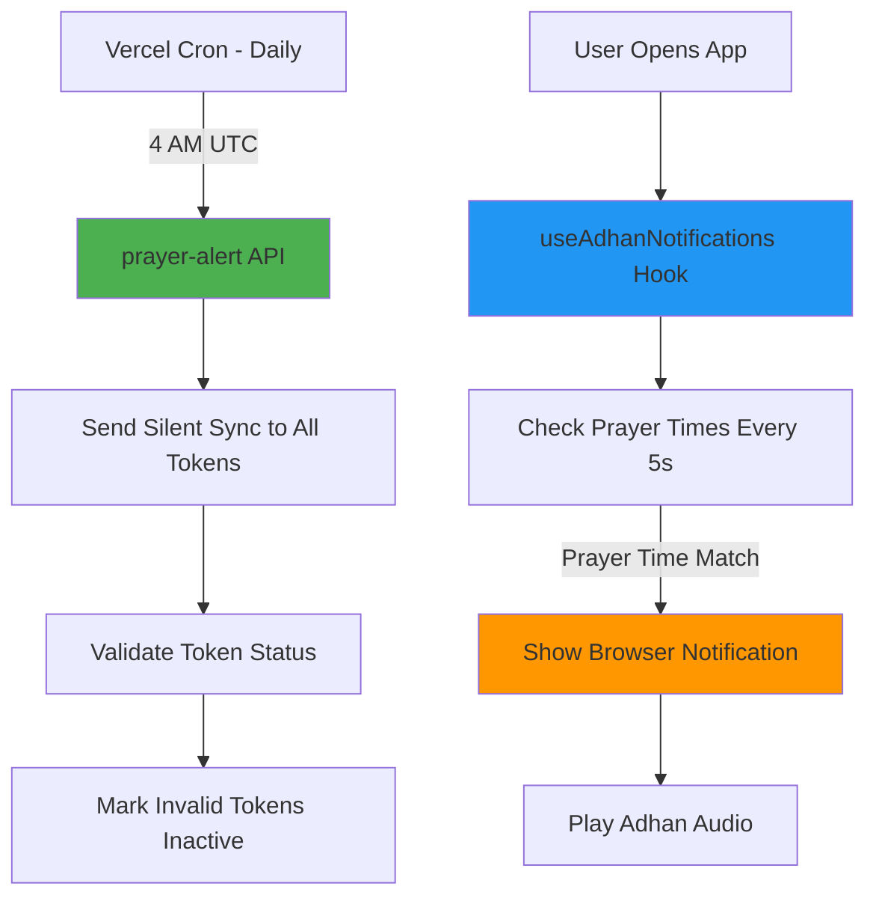

# Hybrid Notification Approach - Implementation Summary

## Changes Made

### 1. Cron Schedule Update
**File**: `vercel.json`
- **Before**: `*/5 * * * *` (every 5 minutes)
- **After**: `0 4 * * *` (once daily at 4 AM UTC / 11 AM WIB)
- **Reason**: Vercel Hobby plan only allows cron jobs to run once per day

### 2. Prayer Alert Endpoint Refactor
**File**: `src/app/api/notifications/prayer-alert/route.ts`

**New Purpose**: Daily sync job instead of real-time prayer notifications

**What it does now**:
- Runs once per day via Vercel Cron
- Sends silent background notifications to all active FCM tokens
- Keeps tokens fresh and validates their status
- Marks invalid tokens as inactive automatically

**What it does NOT do anymore**:
- Does NOT send prayer time notifications
- Does NOT check current prayer times
- Does NOT send visible notifications to users

### 3. Client-Side Notifications (Already Exists)
**File**: `src/hooks/useAdhanNotifications.ts`

**This hook handles**:
- Real-time prayer time detection (checks every 5 seconds)
- Browser notifications at exact prayer times
- Adhan audio playback
- User preferences for each prayer

**How it works**:
- Runs in the browser when app is open
- Uses local prayer time data from `usePrayerTimes` hook
- Triggers notifications using browser Notification API
- Plays Adhan audio from selected Muadzin

## How the Hybrid Approach Works



## Pros & Cons

### ✅ Pros
- **Free**: Works on Vercel Hobby plan
- **Accurate**: Client-side checks every 5 seconds
- **Customizable**: User preferences work perfectly
- **Audio**: Adhan plays immediately (client-side)
- **No API limits**: No frequent cron job usage

### ⚠️ Cons
- **Requires App Open**: User must open app at least once per day
- **iOS Background**: Won't work if app is completely closed on iOS
- **Battery**: Client-side checking uses minimal battery (5s interval)

## User Experience

### Best Case (App Open)
1. User opens app in the morning
2. `useAdhanNotifications` hook starts running
3. At exact prayer time → notification + adhan plays
4. Works perfectly all day

### Worst Case (App Closed All Day)
1. User doesn't open app
2. No notifications received
3. Daily sync runs at 4 AM but sends silent notification only

## Recommendation for Users

Add a note in the app settings:
> **💡 Tip**: Keep Nawaetu open in a browser tab to receive prayer time notifications throughout the day. The app runs efficiently in the background.

## Alternative Solutions (Future)

If you want 100% reliable background notifications:

1. **Upgrade to Vercel Pro** ($20/month)
   - Cron can run every minute
   - Server sends notifications at exact prayer times
   
2. **Use Alternative Cron Service**
   - Cloudflare Workers (free tier: every 1 minute)
   - Railway (free tier: flexible cron)
   - GitHub Actions (free: every 5 minutes)

3. **Native Mobile App**
   - Build React Native app
   - True background notifications
   - Better iOS support

## Testing

Test the endpoint:
```bash
./scripts/test-notification.sh https://nawaetu-git-dev-hadian-rahmats-projects.vercel.app/
```

Expected response:
```json
{
  "success": true,
  "message": "Daily sync completed",
  "results": {
    "total": X,
    "sent": X,
    "failed": 0,
    "errors": []
  },
  "note": "Prayer time notifications are handled client-side. This is a daily token refresh."
}
```

## Deployment

1. Commit changes:
```bash
git add .
git commit -m "feat: implement hybrid notification approach for Hobby plan"
git push origin dev
```

2. Merge to main:
```bash
git checkout main
git merge dev
git push origin main
```

3. Verify in Vercel:
   - Check deployment succeeds (no more cron error)
   - Check cron job is scheduled in Vercel dashboard
   - Monitor logs at 4 AM UTC daily

## Monitoring

Check Vercel logs daily at 4 AM UTC (11 AM WIB):
- Should see "Daily Prayer Notification Sync Started"
- Should see successful token refreshes
- Should see invalid tokens marked inactive
